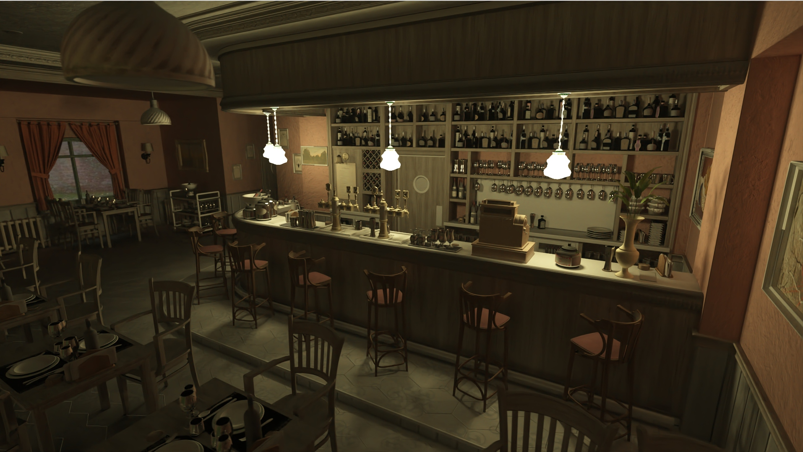

## Padvinder

padvinder (Dutch for path-finder), is a barebones experiment to use the vulkan raytracing capabilities to
create a real time pathtracer with the intent to create photo-realistic images. At this point the project
is very rough with functionalities like scene selection hardcoded and requiring recompilation. While I welcome anyone
wanting to tinker with it, I don't recommend using this project as a starting point, but rather as an implementation
reference for specific features.

### Screenshots

Images generated with this application:

